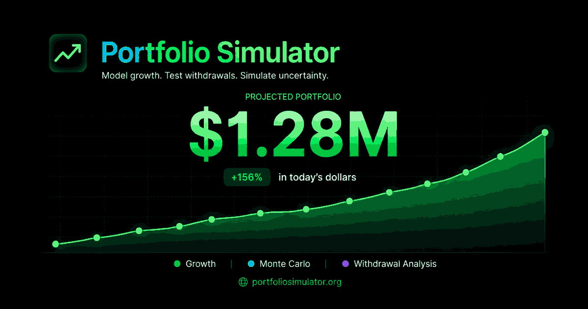

# Portfolio Simulator

[](https://github.com/chedidandrew/Portfolio-Simulator/actions/workflows/web-ci.yml)

**Live site:** [portfoliosimulator.org](https://portfoliosimulator.org)

A responsive financial planning website for modeling portfolio growth, retirement withdrawals, fixed-rate loan payoff strategies, refinancing decisions, and invest-versus-debt tradeoffs with deterministic and seeded Monte Carlo simulations where appropriate.



## Features

- Deterministic portfolio growth and withdrawal projections
- Seeded Monte Carlo simulations with reproducible results
- Fixed-rate loan and amortization calculator with exact payoff schedules
- Extra monthly principal and one-time loan payments with interest/time-saved comparisons
- Target payoff planner that solves for the recurring extra payment needed by a chosen month
- Refinance comparison with closing costs, payment savings, break-even timing, and lifetime remaining cost
- Invest-vs-debt comparison using equal monthly cash commitments and seeded market scenarios
- Shared persistent financial-tool profile so loan balance, APR, term, payment month, and recurring extra cash carry between Loan, Payoff Goal, Refinance, and Invest vs. Debt without re-entry
- Tool-specific payoff, refinance, and investment assumptions persist locally between navigation and browser visits
- Annual, quarterly, monthly, and weekly portfolio cash flows
- Inflation, contribution growth, withdrawals, goals, and multiple tax treatments
- Gross, spendable, tax-drag, and real-dollar reporting
- Shareable, versioned, validated portfolio and loan scenario links
- Excel exports and print/PDF-ready results
- Dark and light themes, responsive layouts, keyboard support, PWA installation, and custom error/404 experiences
- Local browser storage with validation and safe recovery from malformed saved data
- Browser-safety limits for deterministic and Monte Carlo workloads
- Vercel Web Analytics

> Display Currency changes symbols and number formatting only. The site does not perform foreign-exchange conversion.

## Technology

- Next.js 15
- React 18
- TypeScript
- Tailwind CSS and Radix UI
- Recharts
- ExcelJS, loaded only when exporting
- Node.js 24

## Run locally

Install Node.js 24 and run:

```powershell
cd portfolio_growth_simulator/nextjs_space
npm install
npm run dev
```

Open `http://localhost:3000`.

## Validate the website

From `portfolio_growth_simulator/nextjs_space`:

```powershell
npm run verify
```

The verification command runs linting, portfolio/loan/financial-tool regression tests, rendered component tests, TypeScript checking, and the production build. GitHub Actions calls this same command for website pull requests and `main`. A separate browser smoke workflow exercises downloads, Monte Carlo Web Workers, portfolio and loan share links, the financial-tools suite, mobile layout in Chromium and WebKit, and real-browser accessibility checks.

## Production

```powershell
npm run build
npm start
```

The production website is deployed through Vercel from the `main` branch. Application changes should reach `main` only through a pull request after Website CI, Browser Smoke, CodeQL, and the required Vercel check are green on the final head commit. See `docs/DEPLOYMENT.md` and `AGENTS.md` for the maintained production workflow.

## Project structure

```text
Portfolio-Simulator/
├── .github/workflows/                 # GitHub validation and browser workflows
├── portfolio_growth_simulator/
│   └── nextjs_space/
│       ├── app/                       # Next.js routes and global styles
│       ├── components/                # Calculator and UI components
│       ├── hooks/                     # State and calculation hooks
│       ├── lib/                       # Portfolio, loan, and financial-tool engines
│       ├── public/                    # Icons, manifest, and service worker
│       ├── scripts/                   # Project maintenance/test scripts
│       ├── package.json
│       └── package-lock.json
├── docs/DEPLOYMENT.md                 # Production release process
├── AGENTS.md                          # AI-assisted development rules
├── CHANGELOG.md                       # Repository change history
├── LICENSE
└── README.md
```

## Model boundaries

- Results are educational estimates, not financial, tax, lending, legal, or investment advice.
- Monte Carlo results describe modeled scenarios and are not forecasts or guarantees.
- Tax calculations are simplified and do not represent a complete tax return.
- The loan calculator models standard fixed-rate monthly amortization and does not include lender-specific daily-interest rules, variable rates, taxes, insurance, PMI, HOA, escrow, points, or closing costs unless explicitly entered in a comparison tool.
- The refinance break-even estimate is a simplified closing-cost-to-payment-savings measure and does not model time value, equity, tax deductions, or future sale timing.
- The invest-vs-debt comparison excludes investment taxes, mortgage-interest deductions, investment fees, employer matches, and behavioral differences.
- Shared links contain the selected scenario inputs in the URL fragment. Review a link before sharing it publicly.
- Calculator data is stored locally in the browser unless the user deliberately creates a share link.
- Financial-tool results are recalculated from locally saved inputs; the site does not maintain a server-side account or scenario database.
- Detailed formulas, timing rules, and limitations are documented on the website's Methodology pages.

## Change history

Repository and production changes are recorded in `CHANGELOG.md`.

## License

This project is licensed under the BSD 3-Clause License.
